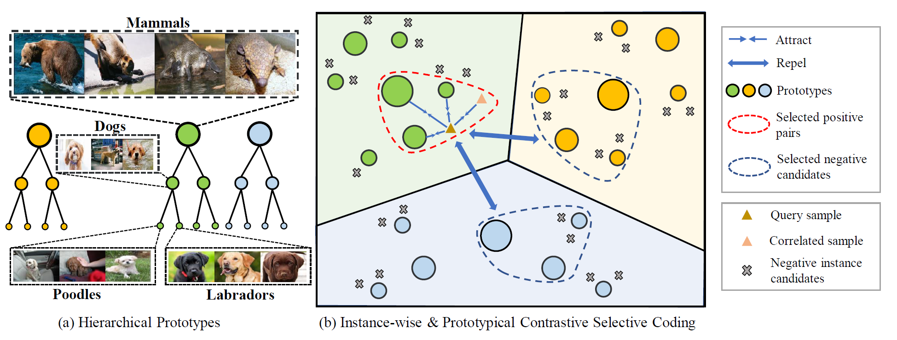

# HCSC: Hierarchical Contrastive Selective Coding
This repository provides a PyTorch implementation and model weights for HCSC (**H**ierarchical **C**ontrastive **S**elective **C**oding), whose details are in [this paper](https://arxiv.org/pdf/2202.00455.pdf) (accepted by CVPR 2022). 

<p align="center">
   
</p>

HCSC is an effective and efficient method to pre-train image encoders in a *self-supervised* fashion. 
In general, this method seeks to learn **image representations with hierarchical semantic structures.**
It utilizes *hierarchical K-means* to derive hierarchical prototypes, and these prototypes represent the hierarchical semantics underlying the data.
On such basis, we perform *Instance-wise and Prototypical Contrastive Selective Coding* to inject the information within hierarchical prototypes into image representations.
HCSC has achieved SOTA performance on the self-supervised pre-training of CNNs (*e.g.*, ResNet-50), and we will further study its potential on pre-training Vision Transformers. 

### Roadmap
- [2022/02/01] The initial release! We release all source code for pre-training and downstream evaluation. We release three pre-trained ResNet-50 models: 200 epochs (single-crop), 200 epochs (multi-crop) and 400 epochs (single-crop, batch size: 256).
- [2022/03/03] More checkpoints released! We update the 400 epochs single-crop model (with 71.0 linear classification accuracy, 64.1 KNN accuracy) and add two new pre-trained ResNet-50 models: 400 epochs (multi-crop, batch size: 256) and 800 epochs (single-crop, batch size: 256).

### TODO
- [x] Finish the pre-training of 400 epochs ResNet-50 models (multi-crop) and release.
- [ ] Finish the pre-training of 800 epochs ResNet-50 models (single- & multi-crop) and release.
- [ ] Support Vision Transformer backbones.
- [ ] Pre-train Vision Transformers with HCSC and release model weights under various configurations.

## Model Zoo

We will continually release our pre-trained HCSC model weights and corresponding training configs. The current finished ones are as follows:   

| Backbone | Method | Crop | Epoch | Batch size | Lincls top-1 Acc. | KNN top-1 Acc. | url | config |
|---------------------|-----------------|---------------------|--------------------|--------------------|----------------------|----------------------|-------------------|-------------------|
| ResNet-50 | HCSC | Single | 200 | 256 | 69.2 | 60.7 | [model](https://hcscpretrained.s3.us-east-2.amazonaws.com/hcsc_200eps.pth) | [config](configs/single_crop_200eps_bs256.yaml) |
| ResNet-50 | HCSC | Multi | 200 | 256 | 73.3 | 66.6 | [model](https://hcscpretrained.s3.us-east-2.amazonaws.com/hcsc_multicrop_200eps.pth) | [config](configs/multi_crop_200eps_bs256.yaml) |
| ResNet-50 | HCSC | Single | 400 | 256 | 71.0 | 64.1 | [model](https://hcscpretrained.s3.us-east-2.amazonaws.com/hcsc_400eps.pth) | [config](configs/single_crop_400eps_bs256.yaml) |
| ResNet-50 | HCSC | Multi | 400 | 256 | 74.1 | 69.9 | [model](https://hcscpretrained.s3.us-east-2.amazonaws.com/hcsc_multicrop_400eps.pth) | [config](configs/multi_crop_400eps_bs256.yaml) |
| ResNet-50 | HCSC | Single | 800 | 256 | 72.0 | 64.5 | [model](https://hcscpretrained.s3.us-east-2.amazonaws.com/hcsc_800eps.pth) | [config](configs/single_crop_800eps_bs256.yaml) |

## Installation

Use following command to install dependencies (python3.7 with pip installed):
```
pip3 install -r requirement.txt
```

If having trouble installing PyTorch, follow the original guidance (https://pytorch.org/).
Notably, the code is tested with ```cudatoolkit version 10.2```.

## Pre-training on ImageNet

Download [ImageNet](https://image-net.org/challenges/LSVRC/2012/) dataset under [ImageNet Folder]. Go to the path "[ImageNet Folder]/val" and use [this script](https://raw.githubusercontent.com/soumith/imagenetloader.torch/master/valprep.sh) to build sub-folders.

To train single-crop HCSC on 8 Tesla-V100-32GB GPUs for 200 epochs, run:
```
python3 -m torch.distributed.launch --master_port [your port] --nproc_per_node=8 \
pretrain.py [your ImageNet Folder]
```

To train multi-crop HCSC on 8 Tesla-V100-32GB GPUs for 200 epochs, run:
```
python3 -m torch.distributed.launch --master_port [your port] --nproc_per_node=8 \
pretrain.py --multicrop [your ImageNet Folder]
```

## Downstream Evaluation

### <a name="lincls"></a> Evaluation: Linear Classification on ImageNet

With a pre-trained model, to train a supervised linear classifier with all available GPUs, run:
```
python3 eval_lincls_imagenet.py --data [your ImageNet Folder] \
--dist-url tcp://localhost:10001 --world-size 1 --rank 0 \
--pretrained [your pre-trained model (example:out.pth)]
```

*Note*: for single-gpu evaluation, turn off the `multiprocessing-distributed`. For example, run:
```
python3 eval_lincls_imagenet.py --data [your ImageNet Folder] \
--dist-url tcp://localhost:10001 --world-size 1 --rank 0 \
--multiprocessing-distributed 0 --gpu 0 \
--pretrained [your pre-trained model (example:out.pth)]
```

### Evaluation: KNN Evaluation on ImageNet

To reproduce the KNN evaluation results with a pre-trained model using a single GPU, run:
```
python3 -m torch.distributed.launch --master_port [your port] --nproc_per_node=1 eval_knn.py \
--checkpoint_key state_dict \
--pretrained [your pre-trained model] \
--data [your ImageNet Folder]
```

### Evaluation: Semi-supervised Learning on ImageNet

To fine-tune a pre-trained model with 1% or 10% ImageNet labels with 8 Tesla-V100-32GB GPUs, run:

#### 1% of labels:
```
python3 -m torch.distributed.launch --nproc_per_node 8 --master_port [your port] eval_semisup.py \
--labels_perc 1 \
--pretrained [your pretrained weights] \
[your ImageNet Folder]
```

#### 10% of labels:
```
python3 -m torch.distributed.launch --nproc_per_node 8 --master_port [your port] eval_semisup.py \
--labels_perc 10 \
--pretrained [your pretrained weights] \
[your ImageNet Folder]
```

*Note*: for single-gpu evaluation, start the script without `torch.distributed.launch`. Remember to modify the `--batch_size` because it is the batch-size-per-gpu. Example:
```
python3 eval_semisup.py --labels_perc 1 \
--batch_size 256 --pretrained [your pretrained weights] \
[your ImageNet Folder]
```

### Evaluation: Transfer Learning - Classification on VOC / Places205

#### VOC

##### 1. Download the [VOC](http://host.robots.ox.ac.uk/pascal/VOC/voc2007/VOCtrainval_06-Nov-2007.tar) dataset.

##### 2. Finetune and evaluate on PASCAL VOC (with a single GPU):
```
cd voc_cls/ 
python3 main.py --data [your voc data folder] \
--pretrained [your pretrained weights]
```

#### Places205

##### 1. Download the [Places205](http://places.csail.mit.edu/user/index.php) dataset (resized 256x256 version)

##### 2. Linear Classification on Places205 (with all available GPUs):
```
python3 eval_lincls_places.py --data [your places205 data folder] \
--data-url tcp://localhost:10001 \
--pretrained [your pretrained weights]
```

*Note*: for single-gpu evaluation, see [instruction above](#lincls).

### Evaluation: Transfer Learning - Object Detection on VOC / COCO

#### 1. Download [VOC](http://places.csail.mit.edu/user/index.php) and [COCO](https://cocodataset.org/#download) Dataset (under ./detection/datasets).

#### 2. Install [detectron2](https://github.com/facebookresearch/detectron2/blob/main/INSTALL.md).

#### 3. Convert a pre-trained model to the format of detectron2:
```
cd detection
python3 convert-pretrain-to-detectron2.py [your pretrained weight] out.pkl
```

#### 4. Train on PASCAL VOC/COCO:

##### Finetune and evaluate on VOC (with 8 Tesla-V100-32GB GPUs):
```
cd detection
python3 train_net.py --config-file ./configs/pascal_voc_R_50_C4_24k_hcsc.yaml \
--num-gpus 8 MODEL.WEIGHTS out.pkl
```

##### Finetune and evaluate on COCO (with 8 Tesla-V100-32GB GPUs):
```
cd detection
python3 train_net.py --config-file ./configs/coco_R_50_C4_2x_hcsc.yaml \
--num-gpus 8 MODEL.WEIGHTS out.pkl
```

### Evaluation: Clustering Evaluation on ImageNet

To reproduce the clustering evaluation results with a pre-trained model using all available GPUs, run:
```
python3 eval_clustering.py --dist-url tcp://localhost:10001 \
--multiprocessing-distributed --world-size 1 --rank 0 \
--num-cluster [target num cluster] \
--pretrained [your pretrained model weights] \
[your ImageNet Folder]
```

In the experiments of our paper, we set ```--num-cluster``` as 25000 and 1000.

## License

This repository is released under the MIT license as in the [LICENSE](LICENSE) file.

## Citation

If you find this repository useful, please kindly consider citing the following paper:
```
@article{guo2022hcsc,
  title={HCSC: Hierarchical Contrastive Selective Coding},
  author={Guo, Yuanfan and Xu, Minghao and Li, Jiawen and Ni, Bingbing and Zhu, Xuanyu and Sun, Zhenbang and Xu, Yi},
  journal={arXiv preprint arXiv:2202.00455},
  year={2022}
}
```